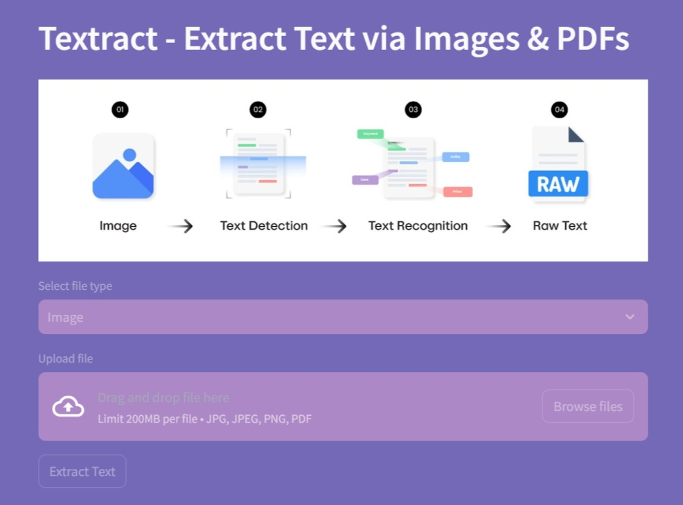

# PaperMint

**Extracts citations from academic documents without inventing any.**

PDF, image, Word and PowerPoint go in. BibTeX, RIS, CSV, Excel, Word and PDF come
out, with a document summary and a finished reference list set in APA, MLA, IEEE
or Chicago.

[](https://www.python.org/downloads/)
[](tests/)
[](https://docs.astral.sh/ruff/)
[](LICENSE)



---

## Why it exists

Citation tools guess. Give one a malformed reference and it returns something
plausible — a city as an author, a page count as a title — because returning
*something* looks better than returning nothing. You then check every field by
hand, which is the work you were trying to avoid.

PaperMint refuses to guess. **A field it cannot read confidently is left empty
and reported as missing.** A document with no bibliography produces zero
citations and says so.

That rule is enforced, not aspired to:

- Every parser proposes candidates in order of reliability and validates each one
  before accepting it. A rejected candidate leaves the field empty.
- **No named-entity recognition for authors.** NER reports place names and common
  nouns as people, and a fabricated author is worse than a missing one.
- A title that is really a page locator, a DOI, a URL, a publisher or an author
  list is rejected. A page range that is really two calendar years is rejected. A
  catalogue imprint — `Washington, D.C. Childrens Books, 1933` — is not a person.

---

## Measured accuracy

Precision and recall against a labelled corpus of 27 references spanning APA,
MLA, IEEE, physics venue-tail, arXiv, catalogue imprints and awkward name
forms. Every field is labelled, **including the ones that should come back
empty**, so inventing a value is scored as a false positive rather than passing
unnoticed.

| Field | Precision | Recall |
|:---|---:|---:|
| Title | 92.6% | 100% |
| Authors | 100% | 100% |
| Year | 100% | 100% |
| Journal | 95.0% | 95.0% |
| Volume | 100% | 100% |
| Issue | 100% | 100% |
| Pages | 100% | 90.0% |
| DOI | 100% | 100% |
| Publisher | 100% | 50.0% |
| **Overall** | **98.0%** | **96.7%** |

Precision above recall is the design working: the parser misses a field rather
than inventing one. Publisher recall is the clearest example — it declines any
trailing phrase it cannot confirm is a publisher, so it finds half of them and
fabricates none.

Reproduce it with `pytest -s -k accuracy_report`. The suite fails if overall
precision drops below 90% or recall below 80%, so the numbers above cannot
quietly rot.

---

## Quick start

Requires Python 3.10+, and Tesseract only if you want to read scanned images.

```bash
git clone https://github.com/Akki-333/PaperMint.git
cd PaperMint

python -m venv .venv
.\.venv\Scripts\activate        # Windows
source .venv/bin/activate       # macOS and Linux

pip install -e .
streamlit run app.py            # opens at http://localhost:8501
```

It also runs headless, which is how the layering is proved — the engine imports
nothing from Streamlit:

```bash
papermint paper.pdf                                  # BibTeX to stdout
papermint *.pdf --format ris --out references.ris    # merged RIS
papermint paper.pdf --json                           # full structured result
```

Exit codes: `0` clean, `1` at least one file failed, `2` nothing readable.

---

## What it does

| | |
|:---|:---|
| **Reads five formats** | PDF, PNG and JPEG via OCR, Word, PowerPoint |
| **Repairs the text first** | Folds ligatures, rejoins words split across line breaks, unifies six dash characters, strips page numbers and running headers. This matters more than any parsing heuristic |
| **Finds every bibliography** | Not just the last `References` heading. A file with a list per chapter, or separate primary and secondary sources, yields all of them; an appendix or index between two lists stays in the body |
| **Parses ten fields** | Title, authors, year, journal, volume, issue, pages, DOI, publisher, URL |
| **Detects and renders four styles** | APA 7, MLA 9, IEEE and Chicago 17 — recognised on the way in, rendered as a finished reference list on the way out |
| **Reports coverage per entry** | How many fields it could read, and exactly which are missing. Below 50% is flagged for review |
| **Lets you correct it** | Inline editor on every card; the score updates to match |
| **Merges duplicates across files** | A batch cites the same work from several documents; entries sharing a DOI, or a title and year, are merged into the fullest record with every source file named on it. Anything with weaker identity is left alone |
| **Quarantines junk** | A segment carrying no bibliographic evidence is dropped from the list and from exports rather than shown as a citation |

Four screens: **Document analyzer** (one file), **Batch processing** (many, with a
merged export), **Reference formatter** (set any reference in all four styles), and
**About**.

---

## How a document is read

```
EXTRACT ──▶ CHARACTERIZE ──▶ PARSE ──▶ SUMMARIZE
```

| Stage | What happens |
|:---|:---|
| **Extract** | A decoder is resolved by MIME type then extension, and the raw text is repaired — ligatures, soft hyphens, dashes, quotes, page furniture |
| **Characterize** | Five strategies in descending reliability: a reader override, a first line declaring the document a bibliography, `References`-style headings, a backwards density scan, then nothing found. Returns the block, the document kind, and readable notes on how it decided |
| **Parse** | The block is split into entries — numbered prefixes, blank lines, hanging indent, author boundaries — and **every candidate split is validated before acceptance**, which is what stops prose being shredded into fake entries. Each entry is then parsed field by field |
| **Summarize** | Reference lines stripped, sentences scored by content-word frequency with a positional boost. A document that *is* a reference list gets a factual description rather than its own citations read back to it |

---

## Architecture

Four layers. The arrows only ever point downward.

```
PRESENTATION    src/papermint/ui/  and  app.py     Streamlit lives ONLY here
      │  DocumentInput, PipelineOptions
      ▼
ORCHESTRATION   src/papermint/pipeline.py          PipelineService
      ▼
DOMAIN          extractors/ parsers/ formatters/   pure Python, headless
                exporters/ enrichment/
      ▼
DATA MODEL      models.py  errors.py  config.py
```

Four rules, and they are **enforced statically** rather than left to convention —
`tests/test_architecture.py` parses every module with `ast` and names the file and
line that breaks one:

1. No Streamlit below the presentation layer.
2. No presentation imports in the domain layer.
3. Pages talk to the service, never past it into parsers or extractors.
4. No `print()`, no bare `except`, no module without `from __future__ import
   annotations`, no undocumented public definition.

`src/papermint/cli.py` is the runtime proof of rule 1: the same `PipelineService`,
with no Streamlit process anywhere.

<details>
<summary><b>Project structure</b></summary>

```
PaperMint/
├── .github/workflows/ci.yml     # pytest and ruff on every push
├── assets/  docs/
├── src/papermint/
│   ├── config.py                # every constant and threshold
│   ├── models.py                # Pydantic models and enums
│   ├── errors.py                # typed error hierarchy, each with a remedy
│   ├── pipeline.py              # PipelineService — the orchestration layer
│   ├── cli.py                   # headless entry point
│   ├── extractors/              # pdf, image (OCR), docx, pptx, registry
│   ├── parsers/                 # normalizer, detector, splitter, parser, style, summarizer
│   ├── formatters/              # APA / MLA / IEEE / Chicago and their guides
│   ├── exporters/               # bibtex, ris, csv, xlsx, docx, pdf
│   └── ui/                      # theme, styles, components, pages
├── tests/
├── app.py                       # the path you hand to `streamlit run`
└── pyproject.toml
```

The package sits under `src/` so `import papermint` can only resolve to the
installed distribution, never to a directory in the working directory — the suite
therefore tests what a user would actually install.

</details>

---

## Testing

**251 tests, expanding to 492 cases.** None makes a network call, and PDFs are
synthesised in memory with PyMuPDF.

| Suite | Tests | Covers |
|:---|---:|:---|
| `test_architecture.py` | 9 | The four layering rules, parametrised across every module — 237 cases |
| `test_ui.py` | 65 | Markup, escaping, components, sticky state, both palettes' contrast, every page via `AppTest` |
| `test_normalization.py` | 46 | Text repair, parser guards, surname particles, catalogue imprints |
| `test_parsers.py` | 40 | Detection, multi-block collection, splitting, style, fields |
| `test_pipeline.py` | 28 | Orchestration, concurrent batch isolation and ordering, registry, CLI |
| `test_formatters.py` | 23 | Style rendering, list ordering, the honesty rules |
| `test_dedupe.py` | 13 | What must and must not be merged across files |
| `test_models.py` · `test_exporters.py` · `test_accuracy.py` | 27 | Schema, every export format, and the accuracy floors above |

Three gates must pass before any change lands: `pytest`, `ruff check .`,
`ruff format --check .`.

---

## What it does not do

Stated plainly, because a tool that claims to know its own limits should list them.

- **Field coverage is not accuracy.** The percentage on each card counts how many
  fields were populated, not whether they are correct — an entry parsed wrongly
  can still score highly. It is a completeness signal, and the interface says so:
  the badge reads *Complete* / *Partial* / *Sparse*, the tiles read *field
  coverage*.
- **The corpus is small.** 27 labelled references is enough to catch a
  regression and to state a number honestly; it is not enough to claim the
  figures generalise to every document in the wild. Growing it is the next
  piece of work.
- **Publisher recall is 50%.** The parser only names a publisher it can
  confirm, so it misses half of them rather than guessing. That is the intended
  trade, not an oversight.
- **OCR quality bounds everything.** A scanned page Tesseract reads poorly produces
  poor citations; the pipeline repairs text, it cannot recover it.
- **Single user, no persistence.** Results live in Streamlit session state for the
  life of the session. There is no database and no accounts.

---

## Built with

Streamlit · PyMuPDF · Tesseract · python-docx · python-pptx · pandas · openpyxl ·
ReportLab · Pydantic · pytest · Ruff

Release history is in [CHANGELOG.md](CHANGELOG.md).

## License

MIT — see [LICENSE](LICENSE).
